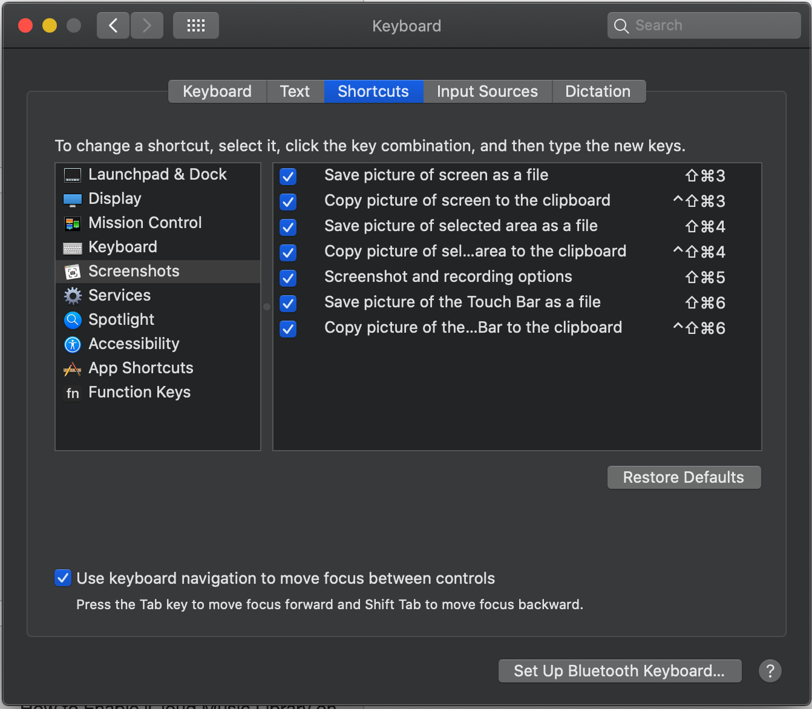

# Dot Files and Configuration Files for setting up my OS X system

## Editors

- Vim
  + .vimrc
- Atom
  + Atom Project Settings folder

## Terminal Commands

- Bash Profile
  + .bash_profile

## Setting up Terminal
* Follow [this guide](https://medium.com/@Clovis_app/configuration-of-a-beautiful-efficient-terminal-and-prompt-on-osx-in-7-minutes-827c29391961)

## Things to Set up on New Machine
* Enable using the keyboard to navigate 

* Enable the keyboard shortcut for _inverting colors_ `⌃⌥⌘8`

## What to Install on a New Machine

1. Homebrew

2. `brew install youtube-dl`

3. `brew install diff-so-fancy`

4. Install `n` for Node Management
    * `curl -L https://raw.githubusercontent.com/tj/n/master/bin/n -o n`
    * `bash n lts`
    * `sudo npm i -g n`

5. Install [Docker for Mac 🐳](https://hub.docker.com/editions/community/docker-ce-desktop-mac/)

6. Install [VSCode](https://code.visualstudio.com/download) 

7. Install [Spotify](https://www.spotify.com/us/download/mac/)

8. Install [Karabiner-Elements](https://pqrs.org/osx/karabiner/)
    * You can place the `karabiner.json` file from this repo in the `~/.config/karabiner` folder.

9. Install [Rectangle Window Manager](https://github.com/rxhanson/Rectangle)
    * You will have to remap the `Hide Others` command in settings -> keyboard -> shortcuts -> applications
    so that the command for _left side_ works with `cntrl + option + H`

10. Install [Chrome](https://www.google.com/chrome/?brand=CHBD&gclid=CjwKCAiAy9jyBRA6EiwAeclQhOHty1inxKlTMqHSHgKbd6j9HCmL9zU3e39GjbL4usZiQeW_j-tDRBoCXmEQAvD_BwE&gclsrc=aw.ds)

11. Install [Goolge Drive Sync](https://www.google.com/drive/download/)